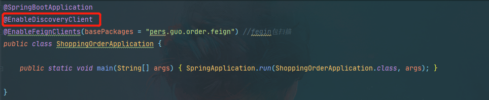

# 初始化项目

## 创建项目

1. 初始化项目


其他几个服务依次类推(shopping-product,shopping-user,shopping-order,shopping-seckill)

2. 修改pom依赖版本

   ```xml
   <properties>
           <java.version>1.8</java.version>
           <spring-cloud.version>2021.0.5</spring-cloud.version>
           <spring-cloud-alibaba.version>2.1.1.RELEASE</spring-cloud-alibaba.version>
       </properties>
   ```

   要注意版本对应，官方版本推荐链接：[版本说明](https://github.com/alibaba/spring-cloud-alibaba/wiki/%E7%89%88%E6%9C%AC%E8%AF%B4%E6%98%8E)

   

## IDEA启动Services(Dashboard)窗口

在微服务开发过程中，我们经常要在本地启动很多个微服务，如果一个个在application启动类去启动肯定会很麻烦，效率很低，页面很乱，下面介绍下IDEA开发工具中得Services管理管理功能，也叫Run [Dashboard](https://so.csdn.net/so/search?q=Dashboard&spm=1001.2101.3001.7020)：

1. 点击菜单栏：Views -> Tool Windows -> Services


2. 刚创建好的窗口是空白的，需要服务加进去。点击最右侧加号Add Service，选择Run Configuration Type，最后选择SpringBoot，IDEA就会把所有项目加进来了。

   

   

​	

## 项目打包发布

### IDEA 工程打包成jar文件

- 打开项目，右击项目选中`Open Module Settings`进入`project Structure`，如下图所示：

  

- 选中`Artifacts`，点击中间的加号（Project Settings->Artifacts->JAR->From modules with dependencies ），如下图所示：

  

- 弹出`Create JAR from Modules`，选择‘Main Class’，然后点击OK

  

- 开始打包，点击右侧的Maven Projects，打开`LIfecycle`，先点击`clean`，再点击`package`，生成target文件夹，里面有以项目名命名加版本号的jar文件，至此打包完成。

  

### java -jar 指定端口或配置文件启动jar

- Windows
  1、指定端口

  ```shell
  java -jar springboot.jar --server.port=8181
  ```

  2、指定配置文件

  ```shell
  java -jar springboot.jar --spring.profiles.active=dev
  ```

  3、同时指定端口与配置文件

  ```
  java -jar springboot.jar --server.port=8181 --spring.profiles.active=dev
  ```

- Linux

  1、后台服务方式启动

  ```shell
  nohup java -jar springboot.jar --server.port=8181 >outlog.log 2>&1 &
  ```

  2.加载服务器配置文件application-dev.yml

  ```shell
  nohup java -Dserver.port=8086  -Dspring.config.additional-location=./application-dev.yml -jar ./springboot.jar> nohup.out 2>&1 &
  ```

  


# 集成Nacos

## 安装Nacos

腾讯云安装Nocos,使用官方推荐稳定版本2.1.1。[官方文档](https://nacos.io/zh-cn/docs/v2/quickstart/quick-start.html)。需要提前安装` JDK 1.8+`

### Linux（Centos7）安装JDK1.8

- [JDK1.8 官网下载地址](https://www.oracle.com/java/technologies/downloads/#java8)

- 上传传压缩包至Linux服务器 

  在soft目录新增jdk文件夹`mkdir jdk`,将压缩包上传到jdk文件夹

  ```shell
  [root@VM-8-9-centos jdk]# ll
  total 135964
  -rw-r--r-- 1 root root 139219380 Apr 19 15:38 jdk-8u371-linux-x64.tar.gz
  ```

- 解压至 /usr/local/ 目录

  ```shell
  tar -zxvf jdk-8u371-linux-x64.tar.gz -C /usr/local/
  ```

  

- 修改配置文件 /etc/profile，配置环境变量

  ```shell
   vim /etc/profile
   
   #set java environment;
     JAVA_HOME=/usr/local/jdk1.8.0_371  #注意#修改为自己的路径，和jdk文件名
     CLASSPATH=.:$JAVA_HOME/lib.tools.jar
     PATH=$JAVA_HOME/bin:$PATH
     export JAVA_HOME CLASSPATH PATH
  ```

  

- 刷新配置文件，检测是否安装成功

  ```shell
  source /etc/profile
  
  java -version #出现jdk版本即安装成功
  ```

  

### Linux（Centos7）安装 Nacos 

- 下载Nacos 2.1.1 安装包，[下载地址](https://github.com/alibaba/nacos/releases)

  

- 将nacos压缩包上传至 nacos目录下

  ```shell
  cd /soft/
  mkdir nacos 
  ```

  

- 解压至 `/usr/local/`

  ```shell
   tar -zxvf nacos-server-2.1.1.tar.gz -C /usr/local/
  ```

  

- 修改nacos 配置文件（`nacos/conf/application.properties`）

  ```shell
  # 可以下载本地编辑之后上传覆盖
  vim /usr/local/nacos/conf/application.properties
  ```

  

- 数据库创建`nacos`数据库，执行nacos自带的sql脚本。脚本位置:`/usr/local/nacos/conf/nacos-mysql.sql`

  

- 启动nacos

  修改配置文件为单机模式启动,将 `MODE="cluster" `改为`MODE="standalone"`

  ```shell
  # 文件路径:/usr/local/nacos/bin/startup.sh
  vim /usr/local/nacos/bin/startup.sh
  ```

  

  ```shell
  # 在 /usr/local/nacos/bin/下执行
  sh startup.sh
  ```

- 开放端口

  ```shell
  # 1. 关闭防火墙
  1. systemctl stop firewalld 
  
  # 2. 防火墙开放8080端口
  1. firewall-cmd --zone=public --add-port=8848/tcp --permanent
  2. systemctl restart firewalld   //重启
  ```

- 页面访问`http://ip:port/nacos/index.html#/login`,账号密码默认都是`nacos`

  	

## Nacos使用

###  Nacos服务注册/发现

- 引入服务注册的包

  ```xml
          <!--这个是springcloud2020版之后要加的引包，不然会读取不到nacos配置中心的文件-->
          <dependency>
              <groupId>org.springframework.cloud</groupId>
              <artifactId>spring-cloud-starter-bootstrap</artifactId>
          </dependency>
          <dependency>
              <groupId>com.alibaba.cloud</groupId>
              <artifactId>spring-cloud-starter-alibaba-nacos-discovery</artifactId>
              <version>${spring-cloud-alibaba.version}</version>
              <exclusions>
                  <exclusion>
                      <groupId>org.springframework.cloud</groupId>
                      <artifactId>spring-cloud-starter-netflix-ribbon</artifactId>
                  </exclusion>
              </exclusions>
          </dependency>
          <dependency>
              <groupId>com.alibaba.cloud</groupId>
              <artifactId>spring-cloud-starter-alibaba-nacos-config</artifactId>
              <version>${spring-cloud-alibaba.version}</version>
          </dependency>
  ```

- 配置文件bootstrap.properties（或bootstrap.yml）

  ```yml
  server:
    port: 9090
  
  spring:
    application:
      name: shopping-order
    cloud:
      nacos:
        discovery:
          server-addr: 129.204.200.175:8848 #nacos服务地址
          #namespace: fafa1d68-7eda-4300-aeb4-5452afa09248 #命名空间，在nacos界面上新增空间名称
        config:	#配置中心
          server-addr: 129.204.200.175:8848 #nacos服务地址
  ```

- 启动类加注解：`@EnableDiscoveryClient`

  

  


### 使用配置中心

- 打开nacos界面，在配置管理-配置列表-"+"

  

- 新增配置

  

  

- 使用`@RefreshScope` 实现配置自动更新,直接使用`@Value("${name}")`获取配置文件的值

  

​		

## Nacos 异常处理

### Nacos 内存溢出

- 2核2G腾讯云服务器，nacos启动一段时间自动关闭

- 首先查看nacos 日志，确认是否服务异常

  ```shell
   tail -n 100 nacos.log
  ```

  ```shell
  [root@VM-8-9-centos logs]#  tail -n 100 nacos.log
  2023-05-02 23:02:02,731 INFO Starting Nacos v2.1.1 using Java 1.8.0_371 on VM-8-9-centos with PID 11918 (/usr/local/nacos/target/nacos-server.jar started by root in /usr/local/nacos/bin)
  
  2023-05-02 23:02:02,732 INFO The following 1 profile is active: "standalone"
  
  2023-05-02 23:02:07,233 INFO Tomcat initialized with port(s): 8848 (http)
  
  2023-05-02 23:02:07,245 INFO Starting service [Tomcat]
  ```

  没有异常记录，怀疑是否是后台将进程杀掉（PID:11918）

- 查看内存溢出错误

  ```shell
  journalctl -k | grep -i -e memory -e oom
  ```

  ```shell
  May 02 23:47:13 VM-8-9-centos kernel: YDService invoked oom-killer: gfp_mask=0x201da, order=0, oom_score_adj=0
  May 02 23:47:14 VM-8-9-centos kernel:  [<ffffffffb4bc25cd>] oom_kill_process+0x2cd/0x490
  May 02 23:47:14 VM-8-9-centos kernel:  [<ffffffffb4bc1fbd>] ? oom_unkillable_task+0xcd/0x120
  May 02 23:47:14 VM-8-9-centos kernel:  [<ffffffffb4bc2cba>] out_of_memory+0x31a/0x500
  May 02 23:47:14 VM-8-9-centos kernel: [ pid ]   uid  tgid total_vm      rss nr_ptes swapents oom_score_adj name
  May 02 23:47:14 VM-8-9-centos kernel: Out of memory: Kill process 11918 (java) score 326 or sacrifice child
  ```

  查看确实在发生OOM将nacos进程（PID：11918）杀掉了。

- 修改启动脚本,改为1g,看看情况

  


# 服务调用 openfeign

## 代码调用

- 添加依赖

  ```xml
          <dependency>
              <groupId>org.springframework.cloud</groupId>
              <artifactId>spring-cloud-starter-openfeign</artifactId>
          </dependency>
          <dependency>
              <groupId>com.alibaba.cloud</groupId>
              <artifactId>spring-cloud-starter-alibaba-nacos-discovery</artifactId>
              <version>${spring-cloud-alibaba.version}</version>
              <exclusions>
                  <exclusion>
                      <groupId>org.springframework.cloud</groupId>
                      <artifactId>spring-cloud-starter-netflix-ribbon</artifactId>
                  </exclusion>
              </exclusions>
          </dependency>
          <!--负载均衡 远程调用-->
          <dependency>
              <groupId>org.springframework.cloud</groupId>
              <artifactId>spring-cloud-starter-loadbalancer</artifactId>
              <version>2.2.2.RELEASE</version>
          </dependency>
  ```

- 启动类中增加注解

  ```java
  @EnableFeignClients(basePackages = "pers.guo.order.feign") //fegin包扫描
  ```

- 服务调用示例

  订单服务调用商品服务

  - 商品服务`shopping-product`，被调用接口

    ```java
    @RestController
    @RequestMapping("/goods/manager/productCategory")
    public class ProductCategoryController implements ProductCategoryControllerApi {
    
    
        @Override
        public String pathVariableTest(Integer id) {
            return "商品服务【shopping-product】--减少库存"+id;
        }
    }
    ```

  - 订单服务`shopping-order`

    接口定义

    ```java
    package pers.guo.order.feign;
    
    //注意要在注解扫描范围内
    @FeignClient(value = "shopping-product")
    public interface ProductCategoryControllerApi {
    
        @RequestMapping(value = "/goods/manager/productCategory/reduce",method = RequestMethod.GET)
        public String pathVariableTest(@RequestParam("id") Integer id);
    
    }
    ```


## 问题处理

### 未扫描到包

- 异常

  ```java
  A component required a bean of type 'pers.guo.order.feign.ProductCategoryControllerApi' that could not be found.
  ```

- 解决

  启动类中增加注解`@EnableFeignClients`

  

---

### 缺少`ribbon` 依赖

- 异常

  ```java
  Unexpected exception during bean creation; nested exception is java.lang.IllegalStateException: No Feign Client for loadBalancing defined. Did you forget to include spring-cloud-starter-loadbalancer?
  ```

- 解决

  添加`spring-cloud-loadbalance` 依赖

  ```xml
          <!--负载均衡 远程调用-->
          <dependency>
              <groupId>org.springframework.cloud</groupId>
              <artifactId>spring-cloud-starter-loadbalancer</artifactId>
              <version>2.2.2.RELEASE</version>
          </dependency>
  ```

---

### nacos ribbon中造成loadbalanc失效

- 异常

  ```java
  java.lang.AbstractMethodError:org.springframework.cloud.netflix.ribbon.RibbonLoadBalancerClient.choose
  ```

- 解决

  主要原因是还是jar包冲突，去掉spring-cloud-starter-netflix-ribbon依赖，修改nacos依赖

  ```xml
          <dependency>
              <groupId>com.alibaba.cloud</groupId>
              <artifactId>spring-cloud-starter-alibaba-nacos-discovery</artifactId>
              <version>${spring-cloud-alibaba.version}</version>
              <exclusions>
                  <exclusion>
                      <groupId>org.springframework.cloud</groupId>
                      <artifactId>spring-cloud-starter-netflix-ribbon</artifactId>
                  </exclusion>
              </exclusions>
          </dependency>
  ```

### Feign接口层调用参数解析异常

- 异常

  ```java
  fegin调用异常feign.FeignException$MethodNotAllowed: [405] during [GET]
  ```

- 解决

  此时容易出现问题的地方有两个：第一个请求方式不一致，比如provider定义的为Get请求，而consumer采用的是post请求，则会出现异常。

  第二个就是参数导致的，OpenFeign在构造请求时需要@RequestMapping/@RequestParam/@PathVariable/@RequestHeader等来构造http请求。添加@RequesrParam解决此问题。

  ```java
      @RequestMapping(value = "/goods/manager/productCategory/reduce",method = RequestMethod.GET)
      public String pathVariableTest(@RequestParam("id") Integer id);
  ```

  

# 集成Sentinel

## 安装Sentinel

腾讯云安装sentinel,使用官方推荐稳定版本1.8.6。[官方文档](https://sentinelguard.io/zh-cn/docs/quick-start.html)。需要提前安装` JDK 1.8+`

### Linux（Centos7）安装 Sentinel

- 下载 sentinel`1.8.6`版本jar包，[下载地址](https://github.com/alibaba/Sentinel/releases)

  

- 上传jar包到服务器

  在`soft` 目录下创建`Sentinel`目录，然后在`Sentinel`目录下分别创建：`jar`,`log`,`sh`目录。

  上传jar包到`jar`目录下

  

- 编写sentinel.sh启动脚本并上传

  启动脚本配置服务ip和端口

  ```shell
  #!/bin/bash
  #这里可替换为你自己的执行程序，其他代码无需更改
  SENTINEL_NAME=sentinel-dashboard-1.8.6.jar
  #使用说明，用来提示输入参数
  usage() {
   echo "Usage: sh sentinel.sh [start|stop|restart|status]"
   exit 1
  }
   
  #检查程序是否在运行
  is_exist(){
   pid=`ps -ef|grep $SENTINEL_NAME|grep -v grep|awk '{print $2}' `
   #如果不存在返回1，存在返回0 
   if [ -z "${pid}" ]; then
   return 1
   else
   return 0
   fi
  }
  
  #启动方法
  start(){
   is_exist
   if [ $? -eq "0" ]; then
   echo "${SENTINEL_NAME} is already running. pid=${pid} ."
   else
   nohup java -Dserver.port=8718 -Dcsp.sentinel.dashboard.server=129.204.200.175:8718 -Dproject.name=sentinel-dashboard -jar /soft/sentinel/jar/$SENTINEL_NAME > /soft/sentinel/log/sentinellog.file 2>&1 &
   echo "${SENTINEL_NAME} start success"
   fi
  }
  
  #停止方法
  stop(){
   is_exist
   if [ $? -eq "0" ]; then
   kill -9 $pid
   else
   echo "${SENTINEL_NAME} is not running"
   fi
  }
  
  #输出运行状态
  status(){
   is_exist
   if [ $? -eq "0" ]; then
   echo "${SENTINEL_NAME} is running. Pid is ${pid}"
   else
   echo "${SENTINEL_NAME} is NOT running."
   fi
  }
  
  #重启
  restart(){
   stop
   start
  }
  
  #根据输入参数，选择执行对应方法，不输入则执行使用说明
  case "$1" in
   "start")
   start
   ;;
   "stop")
   stop
   ;;
   "status")
   status
   ;;
   "restart")
   restart
   ;;
   *)
   usage
   ;;
  esac
  
  ```

  

- 启动，停止sentinel服务

  ```shell
  //启动sentinel服务
  [root@root sh]# sh sentinel.sh start
  //停止sentinel服务
  [root@root sh]#sh sentinel.sh stop
  ```

- 页面访问`http://ip:port/#/login`,账号密码默认都是`sentinel`

  


### Windows 安装 Sentinel

- 下载 sentinel`1.8.6`版本jar包，[下载地址](https://github.com/alibaba/Sentinel/releases)

  

- 新建一个启动文件：`sentinel-stasrt.bat`

  ```bash
  java -Dserver.port=8718 -Dcsp.sentinel.dashboard.server=localhost:8718 -Dproject.name=sentinel-dashboard -jar sentinel-dashboard-1.8.6.jar
  ```

- 使用`sentinel-stasrt.bat`启动服务

  

## Sentinel使用

- 添加依赖

  ```xml
          <!--Sentinel-->
          <!--阿里的限流工具 sentinel-->
          <dependency>
              <groupId>com.alibaba.csp</groupId>
              <artifactId>sentinel-core</artifactId>
              <version>1.8.0</version>
          </dependency>
          <dependency>
              <groupId>com.alibaba.csp</groupId>
              <artifactId>sentinel-annotation-aspectj</artifactId>
              <version>1.8.0</version>
          </dependency>
          <!-- sentinel客户端与dashboard通信依赖 -->
          <dependency>
              <groupId>com.alibaba.csp</groupId>
              <artifactId>sentinel-transport-simple-http</artifactId>
              <version>1.8.0</version>
          </dependency>
          <dependency>
              <groupId>com.alibaba.cloud</groupId>
              <artifactId>spring-cloud-starter-alibaba-sentinel</artifactId>
              <version>${spring-cloud-alibaba.version}</version>
          </dependency>
  
          <dependency>
              <groupId>org.springframework.boot</groupId>
              <artifactId>spring-boot-starter-actuator</artifactId>
          </dependency>
  
  ```

- 配置文件application.properties（或application.yml）

  ```yml
  spring:
    cloud:
      sentinel:
        transport:
          dashboard: 129.204.200.175:8718 #sentinel地址
          port: 19090 #sentinel监控端口
        eager: true
  ```

  

# 使用Nginx

## 安装Nginx

>Linux操作系统CentOS7安装Nginx

- 下载Nginx，[官网地址](http://nginx.org/en/download.html)

  

- 上传传压缩包至Linux服务器 

  在soft目录新增jdk文件夹`mkdir nginx`,将压缩包上传到nginx文件夹

  

- 解压至 /usr/local/ 目录

  ```shell
  tar -zxvf nginx-1.24.0.tar.gz -C /usr/local/
  ```

  

- 在/nginx-1.24.0目录下执行命令

  ```shell
  ./configure
  make
  make install
  ```

  如果发生`make: *** No rule to make target `build`, needed by `default`. Stop.`异常，需要安装openssl以及 ncurses 组件

  ```shell
  yum install -y openssl*
  yum -y install ncurses-devel
  ```

- 执行完会新生成一个`nginx`文件夹，在nginx文件夹下的`sbin`执行启动命令

  ```shell
  ./nginx -s stop		#停止nginx
  ./nginx	-s quit		#安全退出
  ./nginx -s reload	#修改了文件之后重新加载该程序文件
  ps aux|grep nginx	#查看nginx进程
  ```

##  配置Nginx

- 配置反向代理

  进入`/usr/local/nginx/conf/`目录下,修改`nginx.conf`文件

  在http 下的server 新增配置

  

- 重启启动加载配置文件

  
