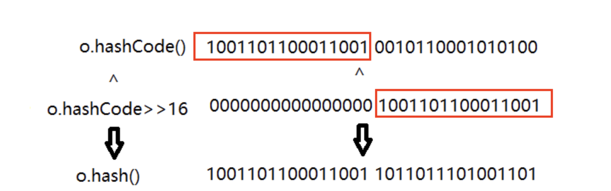
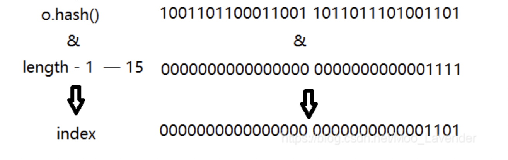
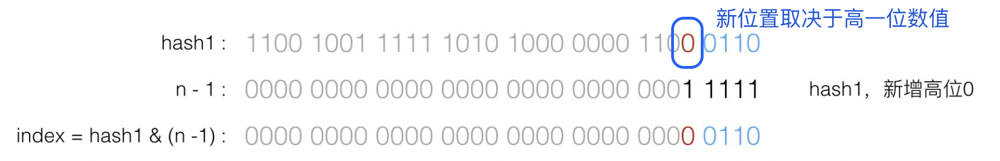
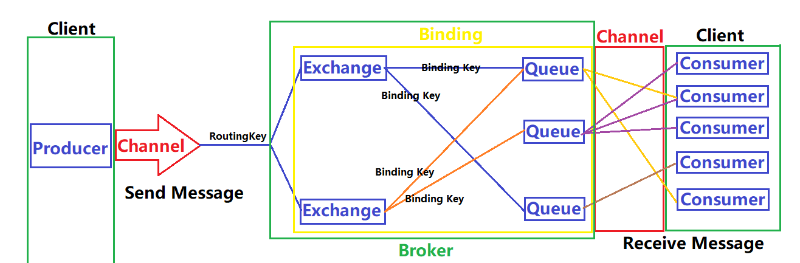
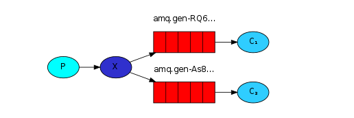
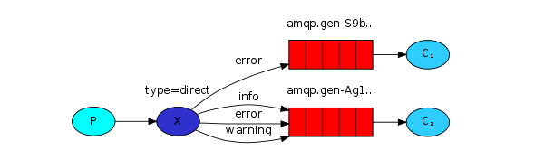
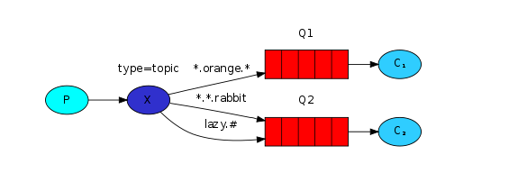
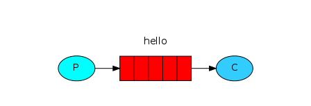
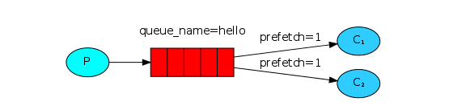

 

# Java 基础


## 内存模型

本地方法区，程序计数器，栈，堆，方法区

其中99%的垃圾回收发生在堆和方法区

本地方法区是调用本地方法接口，其中多线程底层start方法，native 关键字就是调用本地方法接口

方法区（元数据）：存放static，final修饰的变量，class类模版，运行时常量池。

## new一个对象的过程

- 通过classload 类加载器class文件，应用反射生成class对象
- 通过class对象模版，实例化对象

## 类加载机制

JVM 使用双亲委派机制，其中类加载器有：BootstrapClassload加载器，ExtClassload加载器，appclassload加载器。

在加载一个class对象，类加载器会向上尝试还在对应类，一步一步向上检查是否加载，直到BootstrapClassload,如果在类加载器对应目录中未加载到对应类，会向下尝试加载。

双亲委派机制好处：能够保护核心类库安全，保证类的唯一性

双亲委派机制打破自定义类加载器，重新loadclass方法。其中tomcat就打破了双亲委派机制，tomcat是容器，保证多个web项目类隔离。

## 垃圾回收

垃圾回收主要发生在堆中，其中分为新生代和老年代，新生代又分为：eden区，幸存者from/to区。

新生代：新生代的垃圾回收称为轻GC，当eden区对象满之后，会触发轻GC，将还存在对象引用对象存入from1区，其余清除。等下次e den区对象再次满之后，轻GC会一起将eden,from区对象还存在对象引用对象存入to区，其余对象清除。经历过from/to区15次转换，还存活的对象会存入老年代。其中`eden:from:to =8:1:1`

老年代：发生的垃圾回收称为重GC


动态年龄判断：正常新生代from/to区15次转换之后还存活的对象会存入老年代，但是在还未到15次之前有可能超过空间的50%，就会需要存入老年代。动态年龄判断可以理解为：在到达x年龄时，内存使用空间超过50%，那么大于x年龄的对象就存入老年代。


老年代空间担保机制：在轻GC时，将年轻代的对象存入老年代，此时不确定要存入的对象能否在老年代存入。所以内部提供了老年代空间担保机制，在进行轻GC时，判断新生代对象总大小和老年代空间比较，判断是否进行重GC。

- 如果开启空间担保机制，在新生代总大小超过老年代空间时，会判断之前每一次进入老年代数据大小的平均值，如果超过就会进行重GC

- 如果在不开启，在新生代总大小超过老年代空间时，就会触发重GC。

空间担保机制可以避免频繁进行老年代的重GC，重GC比较消耗性能。


垃圾回收算法

标记清除算法：标记还存在对象应用对象，其余清除。容易产生内存碎片。

复制算法：将空间划分，将存活对象复制到新空间，然后清除其余数据。但是会浪费一部分空间。适用于对象存活时间短，类似于新生代中的对象。

标记整理算法：基于标记清除算法，然后将剩余对象进行整理，解决标记清除算法产生的内存碎片，但是整理是比较消耗性能。


- parnew垃圾回收器，是JVM年轻代垃圾回收器，是多线程执行，使用复制算法。

- CMS垃圾回收器：老年代回收器，此垃圾回收器是以吞吐量最优，要求最短垃圾回收停顿时间。使用标记清除算法，允许存在一定量的内存碎片，在超过碎片的阈值，会执行清除-整理算法。

其中CMS 存在4个阶段

1. 标记存活对象，会造成程序暂停（STW）,这个时间很快。
2. 并发标记：不会STW，链路追踪，垃圾回收线程和用户线程并行，标记对象
3. 重新标记：会STW，标记一些在并发标记阶段发生改变的对象
4. 清除：不会STW，和用户线程并发，清除已经死亡的对象

缺点：并发阶段还是比较消耗CPU性能，而且不能等老年代满了才进行，应为用户线程和垃圾回收是并行的，必须给垃圾回收期间并行的用户线程流出一部分空间，并且这些用户线程也会产生垃圾，是不会清除。


# ES

是基于lunece实现，分布式的搜索引擎。

## 倒排索引

倒排索引数据结构

- Term index:词项索引
- Term dictionary:词项字典
- posting list：倒排表，对应匹配每个词项的数据ID，是一个int数组结构。其中内部使用了两种压缩算法，对于稀疏数组采用rbm算法，稠密数组采用for1算法

评分算法：BM25，TF_IDF两种评分算法。

搜索一次流程：将搜索词分词，查询每个词项命中的倒排表，统计每个倒排表中，每个数据id被命中的次数，进行排序。

词项字典底层使用的是前缀树数据结构


mapping：类比于mysql中的数据表结构，是JSON的数据结构。除了字段名称，类型之外，还会设置分词器，是否评分等。

keyword数据类型：说明此字段不进行分词，用于精确查询。text 数据字段是需要分词，生成倒排索引。


## bool-query

- Must  多个条件必须全部满足
- Should 多个条件其中部分满足 or关系，具体要满足几个，有特定的参数来设置should中要有几个条件满足
- Filter 和must 一样，但是会忽略评分

must 和should同时存在，should会失效。


Match 全文检索

Term 精确查询

区别是对match是要对搜索词进行分词，然后进行检索。

term 是搜索词直接进行精确匹配。


ES 中一般在生成索引时使用最细颗粒度分词，在搜索时使用最粗颗粒度分词。

# Spring

组成模块：Spring code，Spring context，Springaop,spring mvc, spring web

## Bean 生命周期

1. Bean 利用反射，初始化
2. 属性填充，此过程会有循环依赖问题，内部使用三层循环解决
3. 调用aware接口，invokeAwareMethord 接口，对Bean Factory 进行属性设置
4. 调用beanPostProcessor 前置处理器，用的比较的多的是applicationContextPostProcessor，完成对applicationContext设置
5. 调用init- mentored方法，这里要注意是否实现initializingBean 接口，如果实现执行afterPropertySet方法
6. 调用beanpostprocessor后置处理器，AOP是在此阶段完成，调用abstractAutoPoxyCreat
7. 使用get Bean 使用bean
8. 销毁流程

## 循环依赖问题

三级缓存：前两层数据结构为concurrentHashMap<String,Object>,第三层为：HashMap<string，ObjectFactory<>>

循环依赖过程（A,B类互相依赖）

- 实例化A类，进行属性填充，A是一个半成品。
- 为A类生成工厂类，ObjectFactory对象放入三级缓存
- 然后需要注入属性b，在1，2，3级缓冲查找，都未找到
- 实例化B类，进行属性填充，B是一个半成品。
- 为B类生成工厂类，Object Factory对象放入三级缓存
- 进行属性填充属性a，在1，2，3级缓冲中查找，在三级缓冲中找到A类的object factory对象，调用getobject方法，获取到真实的a对象（如果没有a类没有AOP，返回原是对象，否则返回代理对象。正常来说AOP操作是在初始化之后执行，这里要提前暴露），将a对象（半成品）放入二级缓存，并删除三级缓冲中a工厂类。
- 此时B类完成属性填充，将B放入一级缓存，此时b是一个完整对象。
- 然后填充A类中的b属性填充，从一级缓存中获取到完整的b对象，进行填充。
- 完成A类的属性填充，将A放入一级缓冲，删除二级缓冲中的A的半成品。


## Bean作用域

singleton作用域，单例的。所有线程使用用一个Bean，可能存在线程安全问题（区分有状态bean和无状态Bean）。

prototype作用域，每个线程获取bean的时候，都会新创建一个新的Bean,不会存在线程安全问题。

还有一些web的作用域 request，session


有状态Bean：有实例变量的Bean,用户数据存储，是线程不安全的。

无状态Bean：不做数据保存，不变类，类似dao类


## Spring事务

事务和数据库保持一致，spring是关闭了数据库自动提交，将提交回滚交给spring管理。

事务不生效情况

- private 修饰的方法，JDK动态代理使用接口，私有方法一般不写在接口中，CGlib动态代理使用继承实现，私有方法不能被继承。
- Rollbackfor异常捕获有误，如果定义为RuntimeExeception,但是内部抛出I/O异常，这样是捕获不到的。
- 事务期间，做了线程切换，也会造成事务失效，事务实现过程中变量是定义在ThreadLocal 上的。

事务代理对象产生的过程

- 调用构造方法进行实例化

- 调用对象set方法进行属性填充

- 调用后置处理器的前置方法

- 调用invokInitMehtod方法初始化

- 调用后置处理器后置方法，其中调用abstractAuthProxyCreator中的after方法，来判断原始对象是否能找到合适的增强器

  通过切入点，方法判断器，判断类，方法上是否有事务注解。如果方法有事务注解，读取注解基本属性信息（事务传播机制等）

- 找到合适的增强器，调用create Proxy方法创建代理对象，具体使用哪种动态代理，依据是否实现了接口决定。

- 创建代理对象之后，放入一级缓冲中。

事务传播机制

事务传播机制存在其中，其中`required`,`requires_new`,`nested`常用。

 (标记位 `newthransation=true`才会提交事务，标记位是标记每个事务的)

- required(外部没有事务就创建，如果有就加入到事务中)
  - 外部事务开始，将数据库自动提交关闭
  - 拿到数据库连接并放入threadLocal 中，并且外部事务标记为`newthransation=true`
  - 内部事务开始从threadLocal中获取数据库连接，并且内部事务标记`newthransation=false`
  - 执行完逻辑代码，执行到外部事务，取到数据库连接，并且`newthransation=true`
  - 然后执行commit操作，移除threadLocal中的数据库连接，恢复自动提交功能
- requires_new（外部没有事务就创建，如果有就挂起，创建新事务）
  - 外部事务开始，将数据库自动提交关闭
  - 拿到数据库连接并放入threadLocal_A 中，并且标记为`newthransation=true`
  - 内部事务从threadLocal_A取数据库连接，如果取到，就存入threadLocal_B中，清除threadLocal_A中的数据库连接，实现外部事务挂起。
  - 创建新的数据库连接存入threadLocal_A中，内部事务的`newthransation=true`
  - 内部事务执行完，会提交事务，移除threadLocal_A中的新数据库连接，恢复自动提交
  - 然后判断是否有挂起的线程，如果有就从threadLocal_B移除存入threadLocal_A，并且标记位`newthransation=true`
  - 然后执行commit操作，移除threadLocal中的数据库连接，恢复自动提交功能
- nested(外部事务会创建回滚点)
  - 外部事务开始，将数据库自动提交关闭
  - 将拿到的数据库连接放入threadlocalA中去。 并且设置标记位newThransaion=true
  - 内部事务再次从threadlocala取连接，能取到数据库连接，标记位newThransaion=false
  - 此时会创建一个回滚点
  - 内部事务执行完业务代码，如果异常，回滚回滚点，如果正常，清除回滚点 


required:外层如果没有就会新建一个事务，如果有就加入到。

requires_new:不管有没有都会新建事务，如果外层有，会挂起外部事务，内外互补影响，内存回滚不会影响外层。

support：外层有就加入，没有就执行非事务方法。

Not_support:不管有没有都不执行事务，外层有的话，就挂起，执行非事务

mandatory：外层没有就抛出异常，如果有就加入

never：没有就执行非事务，如果有就抛出异常

nested：如果没有就新建事务，如果有就嵌套事务，外层回滚，会回滚内外，内层回滚，只回滚内。


## Spring AOP

正常程序开发是面向对象开发，代码自上而下的执行。这样会产生一些横切性问题，例如日志记录，性能检测，事务等。

这些任务和主业务没关系，将这些任务模块化，使用解耦，以动态代理的方式解决横切性问题，这样只需要关注模块化代码的执行逻辑，执行时机，执行位置。

- 目标对象(target)：使用的AOP的对象。

- 连接点(join-point)：目标对象中的所有方法。
- 切点(point cut)：一部分连接点，要增强的目标方法
- 通知：定义了公共逻辑的执行时机，和执行逻辑，其中环绕通知可以拿到参数，在逻辑内部调用目标对象的原方法。
- 切面：切点和通知组成了完整的一个切面。

AOP底层实现使用了JDK动态代理，CGlib动态代理。

- JDK动态代理：使用反射实现，主要使用了反射包中的Method，Proxy，InvocationHandler对象。

  - Method：目标对象中的方法
  - Proxy：创建代理对象
  - InvercationHandler：重写invoke方法，其中实现公共逻辑

  JDK动态代理是实现目标对象的接口，继承proxy类。会生成一个字节码文件。使用反射机制回调。使用JDK动态代理目标对象必须实现了接口

- CGlib动态代理：使用ASM1操作字节码生成代理对象，主要使用Enhancer 类来创建代理对象。

  会生成三个字节码文件，CGlib动态代理是继承了目标对象类，实现了Factory接口，重写目标对象的中所有方法。因为使用继承实现的，被代理对象和方法不能使用final关键字修饰。

# HashMap

默认参数：扩容因子：0.75，默认数组大小：16

## 版本差异

- 1.7:数组+链表数据结构，插入数据时，采用头插入方式插入，头插入在扩容多线程情况下，会产生环形链表造成死循环。（无限进行链表反转）
- 1.8:数组+链表+红黑树数据结构，采用尾插入的方式。数组初始化是在put方法中，懒汉模式。


## hash 方法

```java
static final int hash(Object key) {
    int h;
    return (key == null) ? 0 : (h = key.hashCode()) ^ (h >>> 16);
}
```

采用hashcode右移16位异或计算




- 将hashcode高位16位右移16位，高位以0补充
- 和原hashcode 进行异或运算，计算出新的hash值

一般数组长度比较小，使用hash值计算数组index时，只有低位参与了散列计算。在hash方法中，将高位进行右移16位，高位和低位进行运算结果，同时保存了高位和低位的信息，这样在计算index1时，高位和低位都参与了计算。

这样hash散列度更高，减少hash冲突。

## 计算index

```java
n = (tab = resize()).length;
if ((p = tab[i = (n - 1) & hash]) == null)
```

使用hash方法获取的散列值和数组长度-1进行位运算获取index1值。

- 使用散列值，可以在数组中分布均匀
- 使用数组长度计算，可以使index1值不会超出数组长度
- 这里使用位运算，效率比取模运算效率高



这里也解释了每次扩容为什么长度是2的幂次方，长度2的幂次方，length-1对应二进制的值`....1111`在进行，这样在进行计算之后分布相对均匀，这样能提升查询效率，空间也不浪费。


## put方法

- 通过hash方法获取到hash值
- 判断table 是否为空，如果为空会发生初始化table。（JDK1.8使用懒汉模式）
- 通过`(n - 1) & hash`计算出数组index，判断对应位置是否有值
- 如果为null，将key,value封装称为node对象存到对应位置（若桶为空，就会出现覆盖情况，在多线程情况下是线程不安全的）
- 如果不为null,发生hash碰撞，判断hash值和key值是否和原位置值一致，如果相等，新的value替换原位置的value。
- 如果和原位置的hash,key不想等，则需要储存新的对象。
- 判断原位置对象是否为`treeNode`对象（继承了node对象）。如果是树对象，将数据封装为树对象，存在红黑树中。
- 如果不是树对象，封装为`node`对象，使用尾插入法，插入到链表中。这里需要判断链表长度和数组长度。
- 判断如果链表长度小于8，插入到链表中。
- 判断如果链表长度大于8，并且数组长度大于64的时候，会转化为红黑树。
- 如果如果链表长度大于8，并且数组长度小于64的时候，会先进行扩容，然后插入。


## get方法

- 通过hash方法获取到hash值
- 通过`(n - 1) & hash`计算出数组index，判断对应位置是否有值
- 如果为null，返回null。
- 如果不为null,取第一个节点，判断hash值和key值是否和第一个节点值一致，如果相等，返回第一个节点。
- 如果和原位置的hash,key不想等
- 判断下一个节点是否为`treeNode`对象（继承了node对象）从红黑树中取。
- 如果不是树对象，遍历链表，直到取到值。

​	

## 扩容机制

hashmap中数组最大长度为2^30。在如下情况会发生扩容。

- 在map中存在的元素超过阈值时 
- 在添加元素，链表长度超过8，数组长度小于64时

扩容步骤

- 判断原数组是否为空数组，如果是进行初始化。
  - 无参构造函数，设置长度为默认16，阈值为12（扩容因子0.75*16）
  - 有参构造函数，传入数字a，取大于a的，最小2的幂次方。
- 如果不是初始化，判断原数组长度是否达到最大长度2^30,如果没有原数组长度*2。
- 计算出新数组长度的阈值
- 遍历数组，取第一个`node`节点，如果不为null,判断是否为链表，单node，红黑树
  - 单node，`hash & (newCap - 1)`计算index方法，计算新数组中位置
  - 遍历红黑树，获取新数组位置
  - 遍历链表，判断每个节点是高位还是低位。如果是低位（0）还是原数组index，如果是高位（1）是原数组index+原数组长度




# JUC 并发包

## ConcurrentHashMap

- 1.7：分段锁，默认并发是16，一旦初始化，Segment 数组大小就固定，后面不能扩容

- 1.8：Volatile+CAS + synchronized 来保证并发安全性

  ```java
      static final int MOVED     = -1; // 代表正在扩容,get 获取数据时，从新数组获取 
      static final int TREEBIN   = -2; // 树节点标识
      static final int RESERVED  = -3; // 预定占位
  ```

### put 方法

- 判断key,value都不允许为Null
- 计算key的hash值
- 进入死循环，判断数组table是否为空，如果为空，执行initTable方法
- 通过`(n - 1) & hash`计算出数组index，判断对应位置是否有值；如果当前位置没有数据，采用CAS方式插入数据，插入成功返回true，跳出循环；
- 判断当前位置的Hash值是否为`MOVED`，如果为`-1`,表示正在扩容，`helpTransfer`去协助扩容迁移数据
- 如果不是以上情况，说明发生了hash冲突，需要把数据添加到链表或者红黑树上
- 使用synvchrinized 锁住当前桶的位置，拿到当前位置数据判断和锁是否同一个。
- 取当前位置的hash值判断是否大于等于0 ，如果是当前桶下是链表或者为空。（hash值为0到n-1,红黑树的hash为-2，hash值大于等于0，可能是链表，也可能是null）
  - 如果是链表：与原位置判断hash,key，来决定是更新数据，还是把数据加到链表尾部
  - 如果是红黑树：使用红黑树
- 判断链表中的个数是否是否大于8，如果大于等于8，调用`treeifyBin`判断尝试将链表转化为红黑树,或者尝试扩容
- `addCount`添加元素个数，在方法内部，如果超过阈值，会进行扩容`transfer`

### initTable 方法

>sizeCtl
>
>- -1表示数组正在进行初始化
>- 小于-1：表示正在扩容
>- 0：表示还没有初始化
>- 正数：如果没有初始化，代表初始化的数组长度。如果已经初始化，代表下次扩容的阈值


- 判断数组是否初始化，如果还没初始化走之后逻辑
- sizeCtl 复制给sc,判断sc是否小于0，如果小于，线程礼让CPU资源
- CAS修改sizeCtl的值为`-1` 如果能修改成功，说明可以进行初始化
- 再次判断数组是否为空
- 获取数组的初始化长度，如果sc大于0，使用sc作为长度，如果为0，使用默认16
- 初始化数组，然后修改sc的值，得到下次扩容的阈值

### treeifyBin 方法

- 判断数组长度是否小于64，如果小于`tryPresize`尝试扩容
- 否者则进行链表转为红黑树

### tryPresize方法

- 对扩容的数组长度做判断，判断是否达到数组最大长度，如果未达到最大长度，保证数组长度是2的n次幂
- 拿到`sizeCtl`判断是否大于0，正数：如果没有初始化，代表初始化的数组长度。如果已经初始化，代表下次扩容的阈值
- 判断数组长度是否为空，如果为空执行初始化数组（与initTable 一致）
- 判断扩容长度是否小于扩容阈值，如果小于说明扩容已经完成
- 不是以上情况，进行扩容操作。判断sc小于0，说明已经开始扩容，帮助扩容`transfer`

### helpTransfer 方法

- tab不为空，且节点为Move类型，且节点下一个元素不为空。（为空则说明是空节点，直接返回）
- 调用`resizeStamp` ,高16位代表扩容的标记（和数组长度有关）、低16位代表并行扩容的线程数
- 当处于迁移状态时（即sizeCtl<0则说明处于迁移态），自旋
  - 扩容容量改变，或扩容结束，或辅助扩容线程达到最大限制，或扩容任务已经分配完，则退出。
  - 修改sizeCtl线程数+1，并辅助迁移数据。辅助完则退出。


# Redis


# Mysql


# clickhouse


# RabbitMQ



基于AMQP机制实现的消息中间件，整体上是生产者与消费者消息模型，实现了消息接收，存储，转发功能。

### 工作流程

- 生产者将消息（消息头中存储了RoutingKey）发送到RabbitMQ上的Exchange上

- Exchange交换机根据路由规则将消息分发给不同的队列
- 最后再把消息传递给订阅了这个队列的消费者


Exchange交换机定义消息路由规则

### 基本概念

- channel 信道：消息推送使用的通道
- message 消息：消息头和消息体组成
- routingKey 路由键：消息头中的一个属性，和bindingKey 一同决定消息路由。一般都是有一个或多个单词组成，多个单词之间以"."分割，例如： item.insert
- Exchange 交换机：定义生产者和队列的匹配规则
- queue 队列：用于存储消息，并且队列中的消息被一个消费者消费之后，不能被其他消费者消费。
- bindingKey 绑定键：定义交换机和队列的绑定规则。


### 消息路由

RabbitMQ路由策略是由Exchange类型和binding决定。每个交换机更具binding在内存存在一个交换机和队列的路由关系表。生产者在发送消息时，在消息头中发送一个routingKey，交换机拿到routingkey之后取路由关系表中匹配bindingKey,匹配规则则是由交换机类型决定的。

常用交换机类型：fanout,direct,topic

### 消息模型

- Fanout 广播模型：生成者发送消息到交换机，交换机将消息转发到所有绑定的队列（不做routingkey和bindingkey的匹配），这样每个消费者都能拿到消息，实现一个消息多个消费者消费。

  - 可以有多个消费者
  - 每个消费者绑定自己的队列
  - 队列都绑定到交换机上

  

- Direct 定向模式：队列只订阅一部分消息。队列和交换机绑定需要指定一个BindingKey,生产者在向交换机中发送消息时，要指定消息的routingKey.需要BindingKey和routingKey完全匹配

  - P：生产者，向Exchange发送消息，发送消息时，会指定一个routing key。
  - X：Exchange（交换机），接收生产者的消息，然后把消息递交给 与routing key完全匹配的队列
  - C1：消费者，其所在队列指定了需要routing key 为 error 的消息
  - C2：消费者，其所在队列指定了需要routing key 为 info、error、warning 的消息

  

- Topic 主题模式：类似于Direct模式，只是BindingKey和routingKey的匹配规则使用通配符。

  - 通配符匹配规则：`#`匹配一个或多个词,`*`匹配不多不少恰好1个词

  

- Sample 简单模型：生产者将消息发送到队列，消费者从队列中获取消息，队列是存储消息的缓冲区。

  

- work 工作模型：一个工作队列，在多个工作者之间分配耗时任务(平均分发),两个消费者一起消费，两个消费者各自消费了一半的消息，而且各不相同，这就实现了任务的分发。

  - 平均分发存在问题，在有的消费者耗时比较长，那么消费快的消费者就会有大量闲置时间
  - 配置实现`能者多劳`，使用basicQos方法和prefetchCount=1 设置。通知RabbitMQ一次不要向消费者发送多于一条消息。（不要向消费者发送新消息，直到它处理并确认了前一个消息。这样可以将消息分派给不忙碌的消费者）

  

### 消息确认机制

生产者确认机制

- 事务机制，是基于AMQP实现

  ```java
  channel.txSelect(); // 将当前channel设置成事务模式
  
  /**
    * ConfirmConfig.exchangeName(交换机名称)
    * ConfirmConfig.routingKey(路由键)
    * message （消息内容）
    */
  channel.basicPublish(ConfirmConfig.exchangeName, ConfirmConfig.routingKey, MessageProperties.PERSISTENT_TEXT_PLAIN, message));
  channel.txCommit(); // 提交事务
  channel.txRollback(); // 回滚事务
  ```

  解决producer与broker之间消息确认的问题。但是会产生生产者和MQ之间的等待确认，降低了MQ的 性能。

- confirm 机制

  生产者将信道设置成confirm模式，一旦信道进入confirm模式，所有在该信道上面发布的消息都会被指派一个唯一的ID(从1开始，单调递增)，一旦消息被投递到所有匹配的队列之后，broker就会发送一个ACK给生产者（包含消息的唯一ID）。如果消息和队列是可持久化的，那么broker先将消息写入磁盘，然后再发出ACK响应给生产者。

  - 同步confirm：每发送一条消息后，调用waitForConfirms()方法，等待服务器端confirm；由于是同步，效率低下。而且如果MQ服务不稳定，可能会导致业务线程一直阻塞，甚至会拖垮应用
  - 批量confirm：每发送一批消息后，调用waitForConfirms()方法，等待服务器端confirm；当一批数据中的某一条数据发送失败的情况下，就会导致这一批所有的数据都会ACK失败，如果处理不当，还很容易产生消息重复消费的问题。
  - 异步confirm：提供一个回调方法，broker确认了一条或者多条消息后，生产者端会回调这个方法；吞吐量高，不用等待上一条消息返回ACK响应，就可以继续发送下一条消息。实现较上面两种比较复杂。在channel上添加Confirm监听事件，handleNack方法处理消息发送失败的逻辑，handleAck方法处理消息发送成功的逻辑。

<hr style=" height:2px;border:none;border-top:2px dotted #185598;" />

消费者确认机制

消费者收到消息，向RabbitMQ发送ACK回执，告知消息已经被消费。

- 自动ACK：消息一旦被接收，消费者自动发送ACK（在消费者程序抛出异常，消息依然被消费）
- 手动ACK：消息接收后，不会发送ACK，需要手动调用

如果消息不太重要，丢失也没有影响，那么自动ACK会比较方便，如果消息非常重要，不容丢失，使用手动ACK

`basicConsume`方法实现：第二个参数true，自动ACK

```java
channel.basicConsume(SAMPLE_QUEUE_NAME, true, consumer)
```

`basicAck`手动进行ACK

```java
/* 手动进行ACK
* deliveryTag：该消息的index
* multiple：是否批量处理，true:将一次性ack所有消息。
*/
channel.basicAck(envelope.getDeliveryTag(), false);
```

```java
// 监听队列，第二个参数false，手动进行ACK
channel.basicConsume(SAMPLE_QUEUE_NAME, false, consumer)
```

### 消息推拉处理模式

在Rabbitmq中有两种消息处理的模式

- 推模式：消息中间件主动将消息推送给消费者,投递消息的个数还是会受到channel.basicQos的限制,这个模式将消息提前推送到消费者，消费者必须设置一个缓存区来存放消息。缓存区可能会发生溢出，但是此模式实时性比较好。`channel.basicConsume`方法
- 拉模式：消费者主动从消息中间件拉取消息，在消费者需要时才去消息中间件拉取消息，这段网络开销会明显增加消息延迟，降低系统吞吐量。实时性较差，消费者难以获取实时消息，具体什么时候能拿到新消息完全取决于消费者什么时候去拉取消息。

总结

1. 推模式更关注消息的实时性
2.  推模式直接从内存缓冲区中获取消息，能有效的提高消息的处理效率以及吞吐量
3. 拉模式更关注消费者的消费能力，只有消费者主动去拉取消息才会去获取消息
4. 默认使用推消息，由于某些限制，消费者在某个条件成立时才能消费消息的场景需要从批量获取消息的场景

### 死信队列

死信队列也是普通队列，支持队列中的消息是从正常队列中移除的消息，正常队列如果不设置死信队列，这些消息将会被抛弃掉。

- 消息被消费方否定确认，使用 `channel.basicNack` 或 `channel.basicReject` ，并且属性`requeue`设置为false
- 消息在队列中存活的时间超过了队列设置的TTL时间
- 消息队列的消息超过了队列的最大队列长度，会把旧的消息丢弃掉

配置死信队列分为以下步骤：

1. 配置业务队列，绑定到业务交换机上
2. 为业务队列配置死信交换机和路由key
3. 为死信交换机配置死信队列

死信消息的变化

1. 如果队列配置了参数 x-dead-letter-routing-key 的话，“死信”的路由key将会被替换成该参数对应的值。如果没有设置，则保留该消息原有的路由key。例如：如果原有消息的路由key是testA，被发送到业务Exchage中，然后被投递到业务队列QueueA中，如果该队列没有配置参数x-dead-letter-routing-key，则该消息成为死信后，将保留原有的路由keytestA，如果配置了该参数，并且值设置为testB，那么该消息成为死信后，路由key将会被替换为testB，然后被抛到死信交换机中。
2. 由于被抛到了死信交换机，所以消息的Exchange Name也会被替换为死信交换机的名称。


基于死信队列可以实现延时队列

设置队列的TTL时间，超时之后移入死信队列，消费死信队列中的消息

# 联通数科

1. 设计组件通用性方面需要有哪些考虑？
2. 组件开发应用到了设计模式？ 
3. HashMap的了解，1.7和1.8的区别？
4. HashMap怎么解决Hash冲突的？
5. Spring三级缓冲是什么？
6. Spring中AOP的了解？
7. 解释一下Spring AOP中切点，切面？
8. 解释一下AOP 代理，两种代理？有什么区别
9. @Transactional 什么情况下会失效？
10. Redis 用过哪几种数据类型？
11.  Redis 淘汰策略
12. <font color=red> Redis设置内存大小，并且满了，如果要操作，会有什么结果？</font>
13. Redis 是单线程还是多线程？
14. Redis 中持久化有哪几种方式？
15. 持久化AOF，如果一条命令执行了100次，文件中会记录多少次 ？
16. AOF 对相同命令有什么操作吗？
17. Redis主从复制原理
18. Redis 分布式锁
19. 使用分布式锁，如果业务逻辑时间长，并且超过过期时间，怎么处理？怎么做时间续期 
20. 说一下mysql 聚集索引和非聚集索引的理解
21. 解释一下索引下推
22. Mysql事务是怎么实现的
23. MVCC 中的三个参数
24. atomicInteger 实现原理
25. volatile 关键字作用
26. 解释一下内存屏障
27. ConcurrentHashMap 说一下理解
28. 说一下对synchronized的理解
29. 公平锁和非公平锁的实现，哪个方法实现？
30. 说一下spring 序列化和反序列化
31. Mysql 有几千万数据，要加一个字段，要怎么处理？
32. JVM 用过哪些命令，Linux1环境，查看一个java进程内存使用情况，使用哪些命令？
33. ES 用过哪些聚合函数
34. 动态脱敏，静态脱敏


